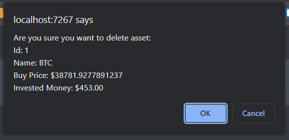

# FundStack 
FundStack is an financial application where users can track all of their investments in crypto, stocks and ETFs in one place.
FundStack provides an overview of the portfolio, tracks current asset prices and various statistics.

## Technologies 
- ASP.NET Core 6.0 
- MVC pattern with service layer
- Microsoft SQL Server 
- Entity Framework Core 
- Dependency Injection
- Web API
- ASP.NET Identity System with roles 
- MVC Areas - adminsitrtation area
- Razor views and partial views
- JavaScript
- HTML / CSS
- Twitter Bootstrap / AdminLTE Template
- Unit Tests >70% code coverage
- Data validation - client-side, server-side, database

## Features 

- Overview of the portfolio with value, profit/loss, ability to add and withdraw money and information about current market
sentiment (Fear and Greed Index)

- Add assets by inputing name and type - current price is fetched automatically from an API. 

- Overview of users's assets 

-- Current asset prices are fetched from API 
-- Profit and loss are automatically calculated
-- Order table by multiple criteria
-- Pagination
-- Sell and Delete functionality

- Portoflio statistics of user's current assets

- History of the portfolio's value

- Ability to sell asset

- Ability to delete asset

- User management page accesible only by users with administrator role

- Assets history - table with all assets that have been sold

